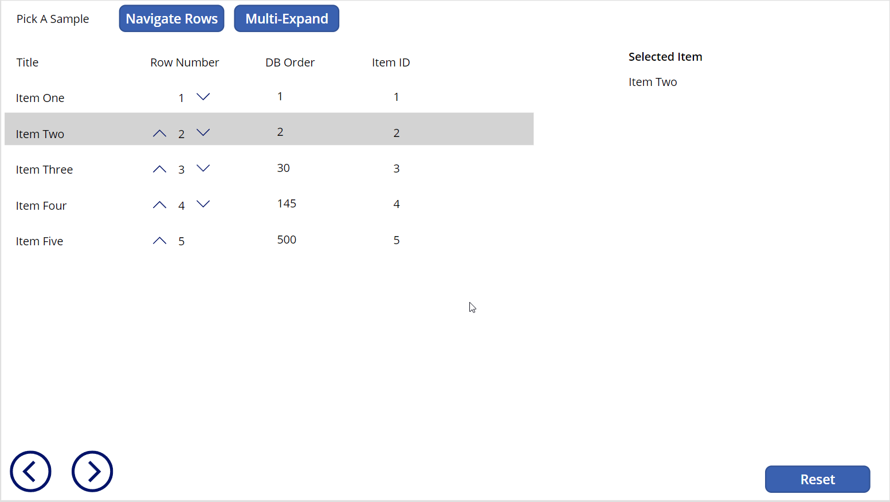
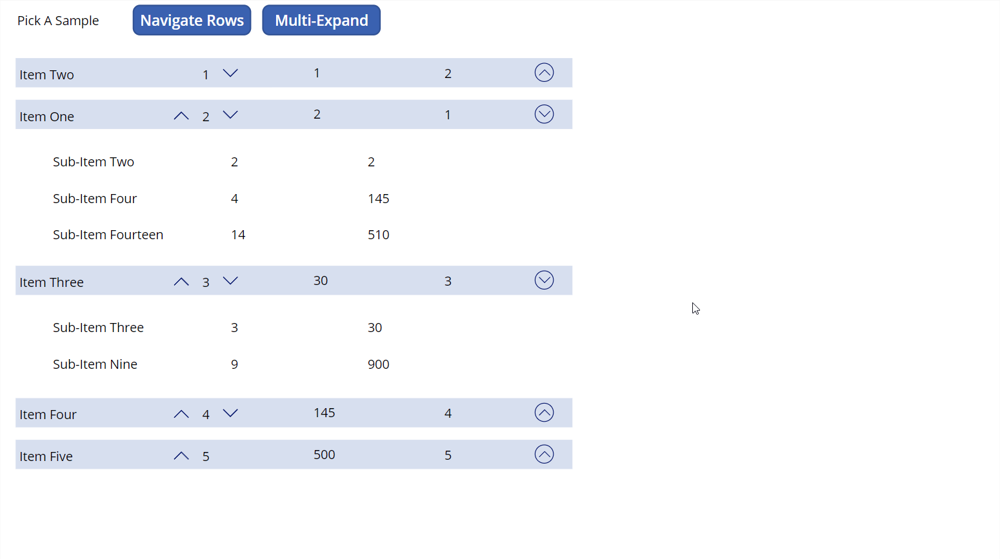

# EnhancedNestedGallery

## Summary

This sample Power App demonstrates how you can build advanced table scenarios using galleries in canvas apps.

## Navigating and Re-Ordering

The **Navigate Rows** demo provides an example for how you can:
- select rows of a gallery and have buttons to navigate fowards or backwards through the gallery items
- re-order items up and down in a gallery

## Multi-Expand Accordion with Nested Gallery

The **Multi-Expand** demo provides an example for how you can:
- have a nested gallery that shows a parent/child relationship
- expand/collapse multiple parent gallery items at a time
- re-order items up and down in the parent gallery

# Installation

1) Download the file [EnhancedGalleryTableExamples_20220629163056.zip](EnhancedGalleryTableExamples_20220629163056.zip).
2) Browse to [https://make.powerapps.com](https://make.powerapps.com).
3) Import the app from the file downloaded in step 1.

_Reference:_ [Importing a Canvas App Package](https://docs.microsoft.com/en-us/power-apps/maker/canvas-apps/export-import-app#importing-a-canvas-app-package)

## Version history

Version|Date|Comments
-------|----|--------
1.0|7/6/2022|Initial release

## Disclaimer

**THIS CODE IS PROVIDED *AS IS* WITHOUT WARRANTY OF ANY KIND, EITHER EXPRESS OR IMPLIED, INCLUDING ANY IMPLIED WARRANTIES OF FITNESS FOR A PARTICULAR PURPOSE, MERCHANTABILITY, OR NON-INFRINGEMENT.**

**This sample code, scripts, and other resources are not supported under any Microsoft standard support program or service and are meant for illustrative purposes only. The sample code, scripts, and resources are provided AS IS without warranty of any kind. Microsoft further disclaims all implied warranties including, without limitation, any implied warranties of merchantability or of fitness for a particular purpose. The entire risk arising out of the use or performance of this material and documentation remains with you. In no event shall Microsoft, its authors, or anyone else involved in the creation, production, or delivery of the sample be liable for any damages whatsoever (including, without limitation, damages for loss of business profits, business interruption, loss of business information, or other pecuniary loss) arising out of the use of or inability to use the samples or documentation, even if Microsoft has been advised of the possibility of such damages.**
